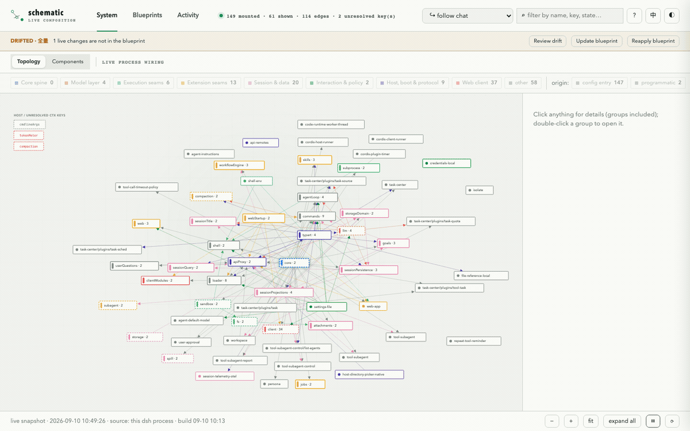

# dsh-schematic

> Read — and rewrite — the wiring of your DeepSeek Harness.

[](LICENSE)
[](https://www.npmjs.com/package/dsh-schematic)
[](https://github.com/Mason-1011/dsh-schematic/actions/workflows/ci.yml)
[](https://github.com/deepseek-ai/deepseek-harness)

**English** | [简体中文](README.zh.md)

See which plugin provides each service, handles each runtime event, and consumes the time behind a DeepSeek Harness turn — then edit that wiring on the graph itself.

```sh
dsh plugin --profile web add dsh-schematic
```



## Status

**v0.3.0 is available now.** The live topology viewer and the composition workbench are both shipped and published to npm as [`dsh-schematic@0.3.0`](https://www.npmjs.com/package/dsh-schematic). The preset workbench and seam-aware market panel are planned for v0.4.

## What this is

DeepSeek Harness (dsh) composes an entire agent product from plugins: every capability — the model adapter, the tool registry, the agent loop itself — mounts onto a shared Cordis context through services, `inject` dependencies, typed events, and reversible effects.

That wiring only exists inside the running process. `dsh-schematic` draws it.

- **Topology view** — an interactive wiring diagram of the mounted plugins: who provides `ctx.fs`, who injects it, which events flow between them, where each capability seam sits. Rendered from the loader's own plugin tree.
- **Composition workbench** (v0.3.0) — edit the wiring **on the graph itself**: toggle plugins, edit an entry's config, swap a seam's provider (local → sandbox → remote). Every change is previewed as ghost nodes plus a YAML diff, dry-run through the same composition the boot performs, backed up, and applied through the harness's own hot reload — reversible with one click.
- **Preset workbench + seam-aware market** *(planned, v0.4)* — compose presets; click an empty seam and see the plugins that can fill it, with conflicts surfaced before install.

## Features

Shipped so far (details per version in the [changelog](CHANGELOG.md)):

**Topology viewer** — served at `/schematic` once mounted.
- Three tabs: **journey** (one message's path through the runtime as stage cards with the ctx keys exchanged), **domains** (radial mesh; family/cluster/core-spine cards open into scope views; group scatter with ⊕ and expand-all; edges drawn provider → consumer with hover cards), **table**.
- Live refresh every 5 s with a change toast; new plugins pulse; `?tab=` and `?expand=all` deep links.
- Failures surface at the unit level: a FAILED internal child fiber fails the entry's whole unit on the graph (with the clipped reason in its panel), and recovery clears it at the next settle.
- One-click EN ⇄ 中文 whole-page switch — descriptions machine-translated in-process, identifiers kept in English.

**Runtime activity** — watch the work flow.
- Every turn, model reply, tool call, workflow run, registry change, host action, background job, and service read is attributed to its owning plugin; the graph lights up while the work flows through it (strong glow during tool runs and model streaming, breathing decay after) and a collapsible timeline names who did what, when, and how long it took.
- **Structure changes are events too** (v0.3.1) — a plugin mounted or unmounted, a seam's provider swapped, a key falling unresolved, a unit flipping into or out of failure: each settled structural change lands as a timeline row and a journal record, so "what did the wiring do when I applied that" stays answerable after the fact.
- A session selector defaults to following the chat you are looking at; subagent/background filtering included.
- **Replay** — the timeline's replay toggle pages back through the session's durable log (over the host's own read-only history RPC), re-attributing each event through the same live fold and merging the journal's live-only rows: who did what from before the viewer was ever open.
- **Stats** — a per-plugin monitoring table over this instance's live window: rows, tool calls and failures, tool time (sum + max), LLM completions, and what each plugin has in flight right now.

**Composer-side star map** — a miniature of the expanded mesh floating beside the chat input.
- One dot per package in a deterministic force-relaxed galaxy; dots light with the viewed conversation's real activity; hover raises a plugin card, double-click opens the full viewer.
- Free placement (drag anywhere, re-docks beside the card), free resizing (viewport is the only ceiling), starfield tints by module hash, deep-space backdrop with a live opacity dial (mouse wheel or Settings).

**Composition workbench** (v0.3.0) — the ✎ toggle in the header, **off by default**: off, the page is exactly the read-only viewer; on, the graph becomes the editor.
- **Preview everything first.** Queued edits render as ghosts on the graph (strikethrough + fade for what goes, dashed + `?` for what arrives), the drawer shows a per-entry diff, the exact managed-block YAML before/after as a line diff, and structure-aware warnings (a service key losing its only provider, a config field your edit drops, a `!!js` expression that a whole-config replace would freeze into a literal).
- **Dry-run before write.** Every apply re-runs the same offline composition the harness boot performs; invalid batches are refused (422) and nothing touches the file. Duplicate entry ids are rejected at plan time — the loader would refuse the whole tree.
- **Toggle & config.** A plugin's detail panel gains its source layer, a protection badge, an enable/disable switch, and an inline config editor prefilled with the entry's current YAML (dropped fields are named; `!!js` values warn before a replace freezes them).
- **Swap providers per seam.** A cluster card lists every registered provider of the seam and the alternatives (in-tree, installed, or catalog) — swapping disables the old and inserts the new in one batch. For packages that are not installed, the install command is offered as copyable text (v0.3.0 does not install for you).
- **Applied safely.** Writes go only to a versioned managed block inside the profile's `cordis.patch.yml` (bytes outside it are preserved verbatim); each apply first takes a timestamped full-file backup and refuses to clobber if the file changed under it (409). The harness hot-reloads the file in ~1–2 s; a reload the harness rejects keeps the old tree running, raises a banner with the error, and offers one-click rollback. Disabling schematic itself is danger-tier: it needs the entry id typed in, and the banner carries the manual-recovery steps.
- **Clear** drops every schematic-made change in one action (the whole managed block, markers included), restoring the file byte-for-byte.

**dsh integration**
- A Settings → *Plugin topology* section (custom Steam-style three-node nav icon) that opens the viewer in a new tab and exposes the backdrop slider.
- *Ask in chat* hand-off: from the viewer, send "explain this plugin" into a fresh Ungrouped conversation — the first question is sent for you through the RPC gateway.

### What it writes — and what it never touches

All observation remains read-only by construction: the plugin never writes to session logs (no custom event types), never wraps or intercepts service return values, and adds no topology edges for its own observers. It does provide one real ctx service — `schematic`, handing out the same live graph the viewer renders (`ctx.schematic.graph()`). That is a capability, not an observation edge: a consumer that injects it shows up on the graph, honestly, as wired to the viewer.

The workbench (v0.3.0) writes exactly two things, both in plainly named places:
- the **managed block** inside the profile's `cordis.patch.yml` — the rows between `# >>> dsh-schematic v1` and `# <<< dsh-schematic v1`; every byte outside those markers is preserved verbatim, and the block is never written without a full-file timestamped backup taken first;
- the plugin's own files under `~/.dsh/schematic/` — the observation journal and those patch backups.

It never writes session logs, the manifest, bundle layers, `dsh.profile.bundles`, or the profile root `cordis.yml` (the `dsh plugin` command's territory). Composition editing is off by default and can be killed entirely from the plugin's own config (`config.edit.enabled=false`); every workbench write rides the harness's own patch-file hot reload, so a rejected reload keeps the old tree running and one click rolls the file back.

## Why nobody else covers this layer

| Layer | Projects | What they show |
|---|---|---|
| Config | [dsh-blueprint](https://www.npmjs.com/package/dsh-blueprint) | booted config + overlay validation; since its v0.6.0 also writes a managed-block overlay |
| Market | [zat-dsh-engine](https://github.com/mishibeikejie/zat-dsh-engine), [dsh-desktop](https://github.com/anywhere-labs/dsh-desktop) | install / manage plugins |
| Session | [dsh-synapse](https://github.com/liangmianya/dsh-synapse), dsh-flowglass | conversation canvases, tool-call flows |
| **Topology** | **dsh-schematic** | **how plugins wire together — and structure-aware editing of that wiring on the live graph** |

Toggling plugins and writing managed-block overlays are solved problems; what nobody else does is treat the graph as the editor — swap a seam's provider where you can see both ends, with ghost previews and a dry-run composition before anything is written.

dsh runs on Cordis, and the Cordis paper [*A Programming Paradigm for Spatiotemporal Composability*](https://github.com/cordiverse/paper) proves a resting-state theorem: no matter how a system rewires itself at runtime, its settled state always equals some one-shot static assembly. dsh-schematic is the UI for that theorem — it renders the static equivalent of whatever the running system currently is.

The agent already has its own "creative mode" (self-modification tools that inspect and remount plugins mid-run). dsh-schematic is the same capability, for the human.

## Non-goals

- Not another generic marketplace, and not an installer — installation rides on the official `dsh plugin` command; v0.3.0 only hands you the command text, and the market (v0.4) will be the supply panel of the graph.
- Not a preset composer (yet) — v0.3.0 edits the live wiring; preset composition joins the market in v0.4.
- Not a ComfyUI-style dataflow canvas — dsh composition is sockets-and-wires dependency injection, not dataflow; a node canvas would be the wrong metaphor.
- Not a conversation-replay canvas — the timeline's replay is plugin attribution ("who did what"), not a way to read conversations; message-level replay belongs to dsh-synapse and dsh-flowglass.

## Requirements

| Component | Supported |
|---|---|
| [DeepSeek Harness](https://github.com/deepseek-ai/deepseek-harness) | `>=0.1.0-rc.8`, web profile |
| `@deepseek-ai/cordis` | `^4.0.1` |
| `@deepseek-ai/cordis-plugin-include` | `^1.0.6` |
| Browser | Current Chromium, Firefox, or Safari (`light-dark()`, `EventSource`) |
| Node.js | `>=22.19` with npm, only when building from source; CI covers Node 22 and 24 |

## Install

Published on npm. The package declares itself as a dsh bundle, so installing it also registers the plugin — no hand-editing of profile configs.

1. Install into your web profile (needs [`dsh`](https://www.npmjs.com/package/@deepseek-ai/dsh) and `pnpm` on PATH):
   ```sh
   dsh plugin --profile web add dsh-schematic
   ```
   That runs `pnpm add dsh-schematic` inside the profile (`~/.dsh/profiles/web`) and adds the package to the profile's bundle layers.
2. (Re)start the web profile and open the viewer:
   ```sh
   dsh web    # then visit http://127.0.0.1:3080/schematic
   ```
3. That's it. You get the viewer at `/schematic`, a **Plugin topology** section in the SPA's Settings, and the composer-side star map — the browser bundle ships inside the package.

Other profiles work the same way (`dsh plugin --profile tui add dsh-schematic`). Upgrading is `dsh plugin --profile web update dsh-schematic`; removing is `dsh plugin --profile web remove dsh-schematic`.

To uninstall cleanly, also drop the `schematic` row from `dsh.profile.bundles` (the reconcile does that automatically on `remove`).

**From source** (maintainers): clone the [public repository](https://github.com/Mason-1011/dsh-schematic), then build with `npm install && npm run build`. Either symlink the checkout into the profile's `node_modules/dsh-schematic` (mount by name; keep the package's own bundle layer or your manual insert — never both, duplicate loader entry ids fail the tree), or run the worked example [`dev.cordis.yml`](dev.cordis.yml) — port 3081 against a harness checkout (`node --import tsx/esm apps/cli/src/bin.ts --profile web --patch dev.cordis.yml`); the dev instance's session root is isolated to `~/.dsh-schematic-dev/`, so dev restarts and kills never touch your live sessions.

## Usage

- **Viewer** (`/schematic`) — switch tabs or deep-link with `?tab=journey|domains|table`; expand every group at once with `?expand=all`; toggle EN/中文 from the header.
- **Star map** — drag the panel anywhere; drag the bottom-right grip to resize; scroll the mouse wheel over it to tune the backdrop (0 = fully transparent); hover a dot for the plugin's card; double-click to open the viewer fully expanded.
- **Settings** → *Plugin topology* — opens the viewer; the backdrop slider two-way syncs with the wheel.
- **Timeline** — the replay toggle pages back through the selected session's history; the stats toggle swaps in the per-plugin count table (polled only while open).
- **Workbench** — the header's ✎ toggles edit mode (off by default). In edit mode: a plugin's panel offers disable/enable and an inline config editor; a cluster card offers provider swap per seam; the drawer previews the queued batch (entry diff + YAML diff + warnings) with apply / rollback / clear. Danger moves (disabling schematic itself) ask for the entry id to be typed in.
- **Ask in chat** — in the viewer, a package's panel offers to ask about it in a fresh conversation, question sent for you.

## How it works

Two halves in one package:

- **Host half** (`src/index.ts`, `src/activity/`, `src/graph.ts`, `src/compose/`, `src/service.ts`) — a Cordis plugin that reads the loader's plugin tree, subscribes in-process to the session-event firehose, agent status, registry callbacks, and the internal service-read waterfall, then serves `/schematic` (viewer page), `/schematic/events` (SSE), `/schematic/mini.json` (polled miniature feed), `/schematic/history` (paged replay), `/schematic/stats.json` (live-window per-plugin counters), and the workbench routes (`/schematic/compose.json` GET + `/compose/preview|apply|rollback|clear` POST) from the harness web server; `src/service.ts` additionally provides the live graph as the `schematic` ctx service (`ctx.schematic.graph()`) for sibling plugins that inject it. The workbench derives the profile's patch file from the loader tree, dry-runs candidate edits through `@deepseek-ai/dsh-app-boot`'s own composition, and writes only the managed block (all YAML round-tripping through `@deepseek-ai/cordis-plugin-include`'s dialect, so `!!js` expressions survive verbatim; both resolved from the profile at runtime, declared as peer dependencies).
- **Browser half** (`src/client/`, bundled to `dist/client.js`) — loads inside the dsh web SPA: contributes the Settings section, dresses the nav icon, mounts the composer-side star map, and handles the ask-in-chat hand-off. The standalone viewer (`dist/engine.js`) is self-booting and talks only to the host routes above.

## Development

```sh
npm run build    # esbuild bundles both browser artifacts
```

`tools/scan.mjs` renders a static graph from a harness checkout (the pre-live v0.1 approach; still handy without a running instance). Internal positioning and naming decisions live in [`DECISIONS.md`](DECISIONS.md).

## Contributing

Issues, compatibility reports, and focused pull requests are welcome. Start with [CONTRIBUTING.md](CONTRIBUTING.md), and include your DSH version, profile, reproduction steps, and relevant browser/host logs in bug reports.

## Roadmap

- v0.4 — preset workbench (compose named wiring presets and switch between them) + seam-aware market panel (supply side of the graph; conflicts surfaced before install)

Shipped history, version by version, is in the [changelog](CHANGELOG.md).

## Acknowledgments

Built on [DeepSeek Harness](https://github.com/deepseek-ai/deepseek-harness) and [Cordis](https://github.com/cordiverse/cordis); the resting-state theorem from the Cordis [paper](https://github.com/cordiverse/paper) is why a live wiring diagram can be read as a stable schematic at all.

## License

[MIT](LICENSE)
